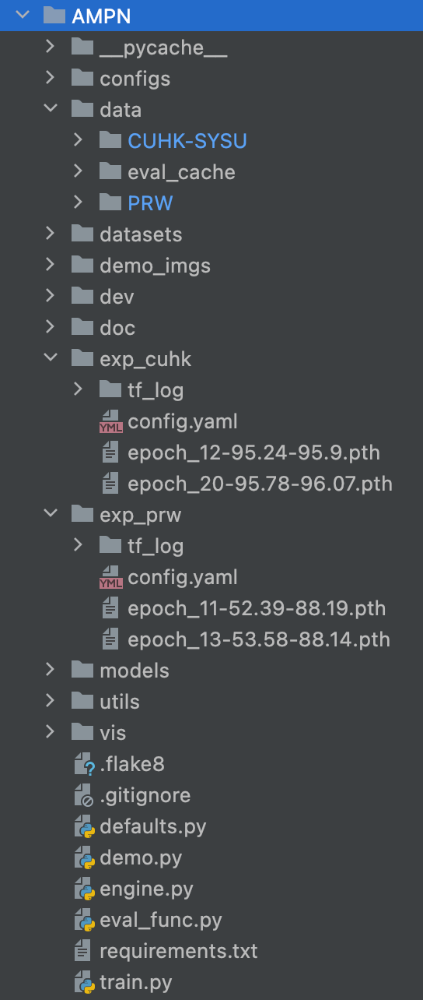

<div align="center">

</div>

This repository hosts the source code of our paper: [Attentive Multi-granularity Perception Network for Person Search](https://github.com/zqx951102/AMPN). 


In this paper, we introduce a novel Attentive Multi-granularity Perception (AMP) module embedded in both the detection and ReID branches. This module leverages discriminative relationship features among different local regions within the person's region of interest (ROI) to address the interference caused by appearance variations and occlusions.

AMPN achieves **state-of-the-art** performance on CUHK-SYSU. Especially on PRW, it achieves a 4.8% mAP gain at a comparable speed to SeqNet. 


Performance profile:

| Dataset   | mAP  | Top-1 | AMPN                                                        |
| --------- | ---- | ----- | ------------------------------------------------------------ |
| CUHK-SYSU | 95.2 | 95.9  | [model](https://drive.google.com/file/d/13bLsi0LQeBLzRzWWBgOvenqVfKFDkAgl/view?usp=sharing) |
| PRW       | 52.4 | 88.2  | [model](https://drive.google.com/file/d/1k8tACTd7_3ATylGjaEEAMISj-smiPBLL/view?usp=sharing) |

| Dataset   | mAP  | Top-1 | AMPN+                                                        |
| --------- | ---- | ----- | ------------------------------------------------------------ |
| CUHK-SYSU | 95.8 | 96.1  | [model](https://drive.google.com/file/d/11Z67ZbOnx972fVByU2MnIT5iu7vUL1eD/view?usp=sharing) |
| PRW       | 53.6 | 88.2  | [model](https://drive.google.com/file/d/1Zkqfh3yWMqOAK2dIOYyPNtYNl23Hi9YN/view?usp=sharing) |


The network structure is simple and suitable as baseline:


## Installation

Run `pip install -r requirements.txt` in the root directory of the project.


## Quick Start

Let's say `$ROOT` is the root directory.

1. Download [CUHK-SYSU](https://drive.google.com/open?id=1z3LsFrJTUeEX3-XjSEJMOBrslxD2T5af) and [PRW](https://goo.gl/2SNesA) datasets, and unzip them to `$ROOT/data`
```
$ROOT/data
├── CUHK-SYSU
└── PRW
```
2. Following the link in the above table, download our pretrained model to anywhere you like, e.g., `$ROOT/exp_cuhk`
3. Run an inference demo by specifing the paths of checkpoint and corresponding configuration file. `python train.py --cfg $ROOT/exp_cuhk/config.yaml --ckpt $ROOT/exp_cuhk/epoch_19.pth` You can checkout the result in `demo_imgs` directory.


## Training

Pick one configuration file you like in `$ROOT/configs`, and run with it.

```
python train.py --cfg configs/cuhk_sysu.yaml
```

**Note**: At present, our script only supports single GPU training, but distributed training will be also supported in future. By default, the batch size and the learning rate during training are set to 5 and 0.003 respectively, which requires about 28GB of GPU memory. If your GPU cannot provide the required memory, try smaller batch size and learning rate (*performance may degrade*). Specifically, your setting should follow the [*Linear Scaling Rule*](https://arxiv.org/abs/1706.02677): When the minibatch size is multiplied by k, multiply the learning rate by k. For example:

```
python train.py --cfg configs/cuhk_sysu.yaml INPUT.BATCH_SIZE_TRAIN 2 SOLVER.BASE_LR 0.0012
```

**Tip**: If the training process stops unexpectedly, you can resume from the specified checkpoint.

```
python train.py --cfg configs/cuhk_sysu.yaml --resume --ckpt /path/to/your/checkpoint
```

## Test

Suppose the output directory is `$ROOT/exp_cuhk`. Test the trained model:

```
python train.py --cfg $ROOT/exp_cuhk/config.yaml --eval --ckpt $ROOT/exp_cuhk/epoch_19.pth
```

Test with Context Bipartite Graph Matching algorithm:

```
python train.py --cfg $ROOT/exp_cuhk/config.yaml --eval --ckpt $ROOT/exp_cuhk/epoch_19.pth EVAL_USE_CBGM True
```

Test the upper bound of the person search performance by using GT boxes:

```
python train.py --cfg $ROOT/exp_cuhk/config.yaml --eval --ckpt $ROOT/exp_cuhk/epoch_19.pth EVAL_USE_GT True
```

## Pull Request

Pull request is welcomed! Before submitting a PR, **DO NOT** forget to run `./dev/linter.sh` that provides syntax checking and code style optimation.

## Project Structure

## Citation

```
@inproceedings{zhang2023AMPN,
  title={Attentive Multi-granularity Perception Network for Person Search},
  author={Zhang, Qixian and Miao, Duoqian},
  booktitle={IEEE Transactions on Circuits and Systems for Video Technology},
  volume={xx},
  number={x},
  pages={xxx--xxx},
