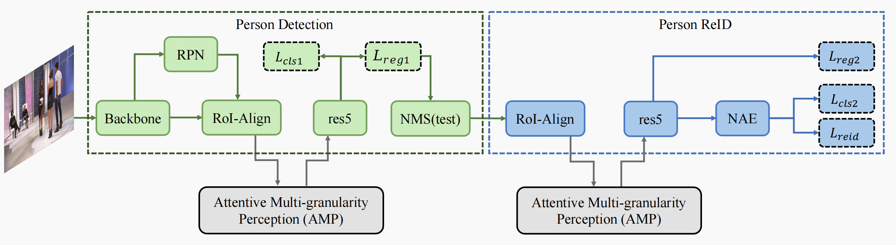
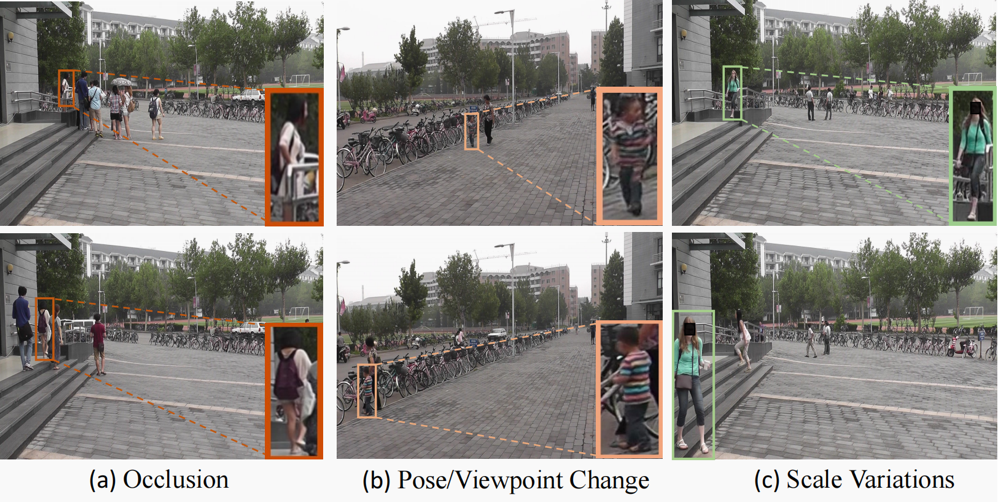
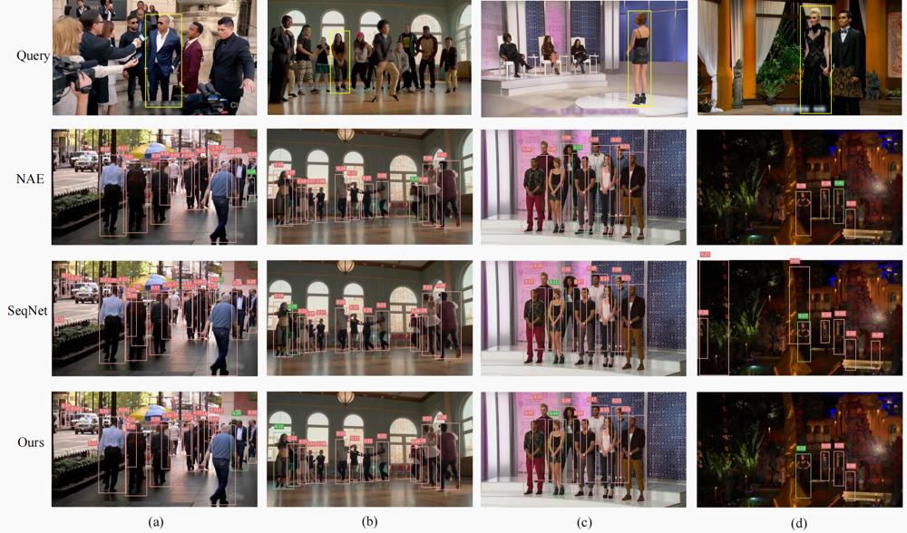

## ↳ Stargazers
[](https://github.com/zqx951102/AMPN/stargazers)
## ↳ Forkers
[](https://github.com/zqx951102/AMPN/network/members)


[](https://opensource.org/licenses/MIT)

<div align="center">

</div>

This repository hosts the source code of our paper: [Attentive Multi-granularity Perception Network for Person Search](https://github.com/zqx951102/AMPN). 


In this paper, we introduce a novel Attentive Multi-granularity Perception (AMP) module embedded in both the detection and ReID branches. This module leverages discriminative relationship features 
among different local regions within the person's region of interest (ROI) to address the interference caused by appearance variations and occlusions.

AMPN achieves **state-of-the-art** performance on CUHK-SYSU. Especially on PRW, it achieves a 4.8% mAP gain at a comparable speed to SeqNet. 


Performance profile:

| Dataset   | mAP  | Top-1 | AMPN                                                        |
| --------- | ---- | ----- | ------------------------------------------------------------ |
| CUHK-SYSU | 95.2 | 95.9  | [model](https://drive.google.com/file/d/13bLsi0LQeBLzRzWWBgOvenqVfKFDkAgl/view?usp=sharing) |
| PRW       | 52.4 | 88.2  | [model](https://drive.google.com/file/d/1k8tACTd7_3ATylGjaEEAMISj-smiPBLL/view?usp=sharing) |

| Dataset   | mAP  | Top-1 | AMPN+                                                        |
| --------- | ---- | ----- | ------------------------------------------------------------ |
| CUHK-SYSU | 95.8 | 96.1  | [model](https://drive.google.com/file/d/11Z67ZbOnx972fVByU2MnIT5iu7vUL1eD/view?usp=sharing) |
| PRW       | 53.6 | 88.2  | [model](https://drive.google.com/file/d/1Zkqfh3yWMqOAK2dIOYyPNtYNl23Hi9YN/view?usp=sharing) |


The network structure is simple and suitable as baseline:




****
## :fire: NEWS :fire:
- [07/2024] **📣Accept**
  
- [06/2024] **📣We received comments requiring minor revisions from the Journal of Information Sciences.**

- [04/2024] **📣We received comments requiring major revisions from the Journal of Information Sciences.**

- [10/2023] **📣We submitted our paper to the Journal of Information Sciences.**
    
- [09/2023] **📣Unfortunately, our paper has been rejected by TCSVT. We would like to express our gratitude to the editors and reviewers for taking the time to review our paper and provide feedback. We highly appreciate the insightful and valuable comments and suggestions from the four reviewers. We will further revise our paper. Keep fighting!**
  
- [08/2023] **📣We submitted our paper to TCSVT !**

- [07/2023] **📣The Attentive Multi-granularity Perception Network for Person Search is released !**
 

## Installation

Run `pip install -r requirements.txt` in the root directory of the project.


## Quick Start

Let's say `$ROOT` is the root directory.

1. Download [CUHK-SYSU](https://drive.google.com/open?id=1z3LsFrJTUeEX3-XjSEJMOBrslxD2T5af) and [PRW](https://drive.google.com/file/d/1Pz81MP8ePlNZMLm_P-AIkUERyOAXWOTV/view?usp=sharing) datasets, and unzip them to `$ROOT/data`

```
data
├── CUHK-SYSU
├── PRW
exp_cuhk
├── config.yaml
├── epoch_12-95.24-95.9.pth
├── epoch_20-95.78-96.07.pth
exp_prw
├── config.yaml
├── epoch_11-52.39-88.19.pth 
├── epoch_13-53.58-88.14.pth
```

2. Following the link in the above table, download our pretrained model to anywhere you like, e.g., `$ROOT/exp_cuhk`
3. Run an inference demo by specifing the paths of checkpoint and corresponding configuration file.  You can checkout the result in `demo_imgs` directory.

```
CUDA_VISIBLE_DEVICES=0 python demo.py --cfg exp_cuhk/config.yaml --ckpt exp_cuhk/epoch_12-95.24-95.9.pth    #CUHK
CUDA_VISIBLE_DEVICES=0 python demo.py --cfg exp_prw/config.yaml --ckpt exp_prw/epoch_11-52.39-88.19.pth     #PRW
```



## Training

Pick one configuration file you like in `$ROOT/configs`, and run with it.

```
python train.py --cfg configs/cuhk_sysu.yaml
```

**Note**: At present, our script only supports single GPU training, but distributed training will be also supported in future. By default, the batch size and the learning rate during training are set to 3 and 0.003 respectively, which requires about 28GB of GPU memory. If your GPU cannot provide the required memory, try smaller batch size and learning rate (*performance may degrade*). Specifically, your setting should follow the [*Linear Scaling Rule*](https://arxiv.org/abs/1706.02677): When the minibatch size is multiplied by k, multiply the learning rate by k. For example:

```
CUHK:
CUDA_VISIBLE_DEVICES=0 python train.py --cfg configs/cuhk_sysu.yaml INPUT.BATCH_SIZE_TRAIN 3 SOLVER.BASE_LR 0.003
if out of memory, run this：
CUDA_VISIBLE_DEVICES=0 python train.py --cfg configs/cuhk_sysu.yaml INPUT.BATCH_SIZE_TRAIN 2 SOLVER.BASE_LR 0.0012
PRW:
CUDA_VISIBLE_DEVICES=0 python train.py --cfg configs/prw.yaml INPUT.BATCH_SIZE_TRAIN 3 SOLVER.BASE_LR 0.003
```

**Tip**: If the training process stops unexpectedly, you can resume from the specified checkpoint.

```
python train.py --cfg configs/cuhk_sysu.yaml --resume --ckpt /path/to/your/checkpoint
```

## Test

Suppose the output directory is `$ROOT/exp_cuhk`. Test the trained model:

```
python train.py --cfg $ROOT/exp_cuhk/config.yaml --eval --ckpt $ROOT/exp_cuhk/epoch_19.pth
```

Test with Context Bipartite Graph Matching algorithm:

```
python train.py --cfg $ROOT/exp_cuhk/config.yaml --eval --ckpt $ROOT/exp_cuhk/epoch_19.pth EVAL_USE_CBGM True
```

Test the upper bound of the person search performance by using GT boxes:

```
python train.py --cfg $ROOT/exp_cuhk/config.yaml --eval --ckpt $ROOT/exp_cuhk/epoch_19.pth EVAL_USE_GT True
```
```
Computational complexity:       404.27 GMac
Number of parameters:           50.88 M
AMPN  CUHK:
CUDA_VISIBLE_DEVICES=0 python train.py --cfg exp_cuhk/config.yaml --eval --ckpt exp_cuhk/epoch_12-95.24-95.9.pth
CUDA_VISIBLE_DEVICES=0 python train.py --cfg exp_cuhk/config.yaml --eval --ckpt exp_cuhk/epoch_12-95.24-95.9.pth EVAL_USE_GT True      #use GT 95.9-96.3
AMPN  PRW:
CUDA_VISIBLE_DEVICES=0 python train.py --cfg exp_prw/config.yaml --eval --ckpt exp_prw/epoch_11-52.39-88.19.pth
CUDA_VISIBLE_DEVICES=0 python train.py --cfg exp_prw/config.yaml --eval --ckpt exp_prw/epoch_11-52.39-88.19.pth EVAL_USE_GT True       #use GT 53.9-90.0

Computational complexity:       610.18 GMac
Number of parameters:           54.99 M
AMPN+  CUHK:
CUDA_VISIBLE_DEVICES=0 python train.py --cfg exp_cuhk/config.yaml --eval --ckpt exp_cuhk/epoch_20-95.78-96.07.pth
CUDA_VISIBLE_DEVICES=0 python train.py --cfg exp_cuhk/config.yaml --eval --ckpt exp_cuhk/epoch_20-95.78-96.07.pth EVAL_USE_GT True     #use GT 96.3-96.6
AMPN+  PRW:
CUDA_VISIBLE_DEVICES=0 python train.py --cfg exp_prw/config.yaml --eval --ckpt exp_prw/epoch_13-53.58-88.14.pth
CUDA_VISIBLE_DEVICES=0 python train.py --cfg exp_prw/config.yaml --eval --ckpt exp_prw/epoch_13-53.58-88.14.pth EVAL_USE_GT True       #use GT 55.0-89.5
```

## Performance on the cross-camera gallery:
(AMPN only on PRW dataset) in eval_func.py, set to False,
```
def eval_search_prw(
    gallery_dataset,
    query_dataset,
    gallery_dets,
    gallery_feats,
    query_box_feats,
    query_dets,
    query_feats,
    k1=30,
    k2=4,
    det_thresh=0.5,
    cbgm=False,
    ignore_cam_id=True,   #You can set it to False to represent "multi-view gallery",
):
```
then run:
```
CUDA_VISIBLE_DEVICES=0 python train.py --cfg exp_prw/config.yaml --eval --ckpt exp_prw/epoch_11-52.39-88.19.pth   ## 49.31-74.62
```
Remember that when you test other code, you still have to set it to true！！


## Evaluation of different gallery size:
AMPN only on CUHK-SYSU dataset, in eval_func.py set gallery_size=100, or 50,100,500,1000,2000,4000.
```
def eval_search_cuhk(
    gallery_dataset,
    query_dataset,
    gallery_dets,
    gallery_feats,
    query_box_feats,
    query_dets,
    query_feats,
    k1=10,
    k2=3,
    det_thresh=0.5,
    cbgm=False,
    gallery_size=100,
):
```
then run:
```
CUDA_VISIBLE_DEVICES=0 python train.py --cfg exp_cuhk/config.yaml --eval --ckpt exp_cuhk/epoch_12-95.24-95.9.pth   ##you can get :[95.76, 95.24, 92.42, 90.43, 88.36, 85.90]
```

Remember that when you test other code, you still need to set it to 100！！

## Performance on the Occluded and Low-Resolution gallery:
only on CUHK-SYSU dataset, In data/CUHK-SYSU/annotation/test/train_test/  first of all, the original TestG100.mat was renamed to 0TestG100.Mat. Upload [Occluded.mat](https://drive.google.com/file/d/1Vhg3atKdRJM0s-6e34WYdswc5748s8y6/view?usp=sharing) and [Low-Resolution.mat](https://drive.google.com/file/d/1bA3bgplRHc790KdBhXpvLueXr8xCnyxC/view?usp=sharing) to ./data/CUHK-SYSU/annotation/test/train_test/

In eval_func.py set gallery_size=100, don't change.

To comment out:
```
assert (
            query_roi - qboxes[0][:4]
         ).sum() <= 0.001, "query_roi must be the first one in pboxes"
```
then Change the Occluded.mat name to TestG100.mat, run:
```
CUDA_VISIBLE_DEVICES=0 python train.py --cfg exp_cuhk/config.yaml --eval --ckpt exp_cuhk/epoch_12-95.24-95.9.pth   # 89.09-89.69
```
then Change the Low-Resolution.mat name to TestG100.mat, run:
```
CUDA_VISIBLE_DEVICES=0 python train.py --cfg exp_cuhk/config.yaml --eval --ckpt exp_cuhk/epoch_12-95.24-95.9.pth   # 85.79-86.24
```
## Qualitative Results:



## Acknowledgment
Thanks to the authors of the following repos for their code, which was integral in this project:
- [SeqNet](https://github.com/serend1p1ty/SeqNet)
- [NAE](https://github.com/dichen-cd/NAE4PS)
- [COAT](https://github.com/Kitware/COAT)
- [GFN](https://github.com/LukeJaffe/GFN)
- [PSTR](https://github.com/JialeCao001/PSTR)
- [GLCNet](https://github.com/ZhengPeng7/GLCNet)
- [torchvision](https://github.com/pytorch/vision)

## Pull Request

Pull request is welcomed! Before submitting a PR, **DO NOT** forget to run `./dev/linter.sh` that provides syntax checking and code style optimation.


## Citation
If you find this code useful for your research, please cite our paper
```
@article{zhang2024attentive,
  title={Attentive multi-granularity perception network for person search},
  author={Zhang, Qixian and Wu, Jun and Miao, Duoqian and Zhao, Cairong and Zhang, Qi},
  journal={Information Sciences},
  volume={681},
  pages={121191},
  year={2024},
  publisher={Elsevier}
}
```

```
@article{zhang2024learning,
  title={Learning adaptive shift and task decoupling for discriminative one-step person search},
  author={Zhang, Qixian and Miao, Duoqian and Zhang, Qi and Wang, Changwei and Li, Yanping and Zhang, Hongyun and Zhao, Cairong},
  journal={Knowledge-Based Systems},
  pages={112483},
  year={2024},
  publisher={Elsevier}
}
```

```
@inproceedings{li2021sequential,
  title={Sequential End-to-end Network for Efficient Person Search},
  author={Li, Zhengjia and Miao, Duoqian},
  booktitle={Proceedings of the AAAI Conference on Artificial Intelligence},
  volume={35},
  number={3},
  pages={2011--2019},
  year={2021}
}
```

## Contact
If you have any question, please feel free to contact us. E-mail: [zhangqx@tongji.edu.cn](mailto:zhangqx@tongji.edu.cn) 
